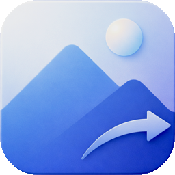

  

<h1 align="center">Image Converter Plus</h1>

  Convert. Resize. Protect.

---

Image Converter Plus is a privacy-focused image conversion app for iPhone and iPad. Convert between JPEG, PNG, HEIC, TIFF, and AVIF — adjust quality, resize, rename, and strip metadata. Everything is processed on-device. No servers, no uploads, no tracking.

- 5 output formats — JPEG, PNG, HEIC, TIFF, AVIF
- Quality control from 40% to 100% with real-time size estimates
- Resize from 50% to 200%
- Granular metadata stripping — location, camera, author, device, edits, previews
- 4 built-in presets for one-tap conversion
- Share Extension for converting without opening the app
- Conversion history with re-export
- Available in 60 languages

  <a href="https://denyslebiediev.github.io/imageconverterplus/">Website</a> · <a href="https://apps.apple.com/app/id0000000000">App Store</a> · <a href="mailto:imageconverterplus.support@gmail.com">Support</a>

© 2026 Denys Lebiediev

